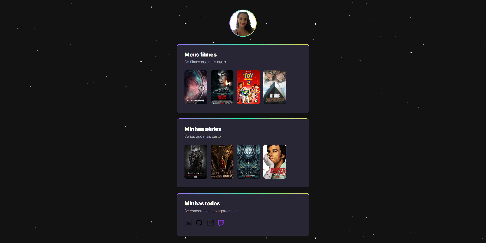
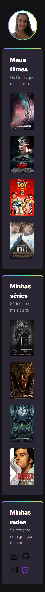

# 📋 Indíce

- [Bem-vindo](#id01)
- [Proposta](#id02)
  - [O desafio](#id02.1)
  - [Objetivo](#id02.2)
- [Meu processo](#id03)
  - [Construção do site](#id03.1)
  - [Aprendizado](#id03.2)
  - [Prosseguimento](#id03.3)
- [Screenshots](#id04)
- [Links](#id05)
- [Tecnologias utilizadas](#id06)
- [Pré-requisitos](#id07)
- [Procedimentos de instalação](#id08)
- [Agradecimentos](#id09)
- [Autora](#id010)

# Bem-vindo! 👋 <a name="id01"></a>

**Centralizador de Links.**

Essa foi a criação de um site sobre filmes e séries

# 🚀 Proposta <a name="id02"></a>

Desafio extra proposto na finalização do evento Next Level Week (NLW) da Rocketseat.

<br />

Data inicial: 18/09/2022

Data final: 21/09/2022

<br />

## :trophy: O desafio <a name="id02.1"></a>

<br />

Os usuários devem ser capazes de: 

- Clicar nas imagens dos filmes e serem direcionados para um link externo de filmes, séries e redes sociais que irá abrir em uma nova janela ou guia.   

- Passar o mouse sob as imagens dos filmes, séries e redes sociais e visualizar efeito hover. 

<br />

## :trophy: Objetivo <a name="id02.2"></a>

<br />

- Realizar o desafio extra proposto no evento Next Level Week (NLW) da Rocketseat.

<br />

# 👩🚀 Meu processo <a name="id03"></a>

<br />

4 dias para concluir o projeto

## :trophy: Construção do site <a name="id03.1"></a>

- Marcação HTML5 semântica
- Propriedades CSS

**Construção:**

1. Criação do arquivo `index.html` e do `style.css`. 

2. Divisões do html em `header` e `main` 

3. Uma lista de navegação `ul` `li` `a` para sites externos e adição de `target` e `_blank` pra abertura do site em uma nova janela ou guia.  

4. Estilização das `sections` e `divs` no css. 

Dentro da pasta `/design` encontra-se o design do projeto. 

## :trophy: Aprendizado <a name="id03.2"></a>

- Organização correta do html em header e main 
- Estilização de sections no css 
- Centralização de section

## :trophy: Prosseguimento <a name="id03.3"></a>

Aplicação de animação no projeto atual

<br />

# :camera_flash: Screenshots <a name="id04"></a>

<br />

## :desktop_computer: Desktop design



## :iphone: Mobile design



<br />

# :heavy_check_mark: Links <a name="id05"></a>

<br />

[🔗Clique aqui para acessar](https://cool-kitsune-a78611.netlify.app/)


<br />

# 🛠 Tecnologias utilizadas <a name="id06"></a>

<br />

- HTML5
- CSS3

<br />

# ☑️ Pré-requisitos <a name="id07"></a>

<br />

- [x] Editor de código de sua preferência (recomendado VS code)
- [x] Git

<br />

# 📝 Procedimentos de instalação <a name="id08"></a>

<br />

Clone este repositório usando o comando:

```bash
git clone https://github.com/RaizaCirne/centralizador-de-links.git
```

Baixar arquivo zip 

Extrir arquivos

Abrir pasta no editor de código.

<br />

# :sunglasses: Agradecimentos <a name="id09"></a>

<br />

Agradeço a Rocktseat por proporcionar um evento excelente e propor desafios para que possamos crescer cada vez mais como desenvolvedores. 

<br />

# :sunglasses: Autora <a name="id010"></a>

<br />

- Personal Page - [Raíza Cirne Braz](https://cool-kitsune-a78611.netlify.app/)
- Frontend Mentor - [@RaizaCirne](https://www.frontendmentor.io/profile/RaizaCirne)
- GitHub - [RaizaCirne](https://github.com/RaizaCirne)
- LinkedIn - [Raíza Cirne Braz](https://www.linkedin.com/in/ra%C3%ADzacirne/)

**HTML - CSS** 🚀
